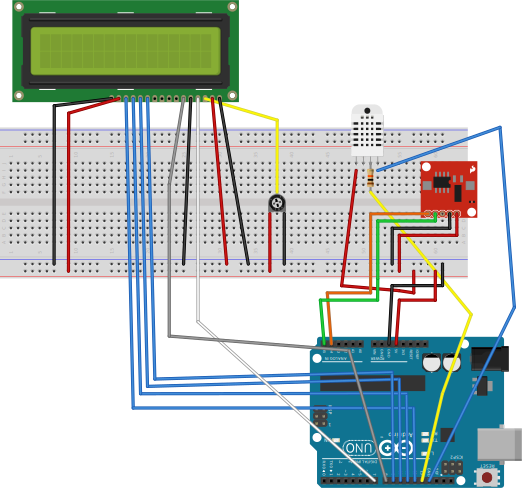

Temperature and Humidity Data Logger using an Arduino UNO and multiple components.
Project is build using the PlatformIO environement. 

Components used:
*DS1307 I2C RTC Clock Module
*Standard LCD 16x2 Display
*DHT11 Humidity & Temperature Sensor

When used with the application/macro located in resources, it will dump the information inside the specified excel sheet. It will also show up on the LCD display.
